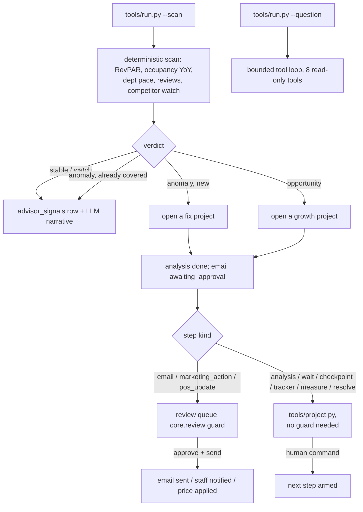

# Strategic Advisor AI - "The Strategist"

Scans every metric across the business daily — revenue pace, occupancy, reviews, competitor moves — investigates anything that shifted, and hunts for growth when things are calm.

## What it does

Scans every metric across the business daily — revenue pace, occupancy, reviews, competitor moves — investigates anything that shifted, and hunts for growth when things are calm. When it finds something, it opens a strategic project and project-manages it end to end: analysis, emails to the team, waiting on replies, checkpoints, live trackers, and a measured € result at the close.

## What it won't do

Never acts without sign-off: every email, price change, and campaign step waits for your approval. It proposes and project-manages; you stay the decision-maker.

## Why it matters

Most hotels find out about a revenue dip weeks later in a P&L review. The Strategist finds it the next morning, tells you why, brings a costed plan — and then actually sees the fix through to a measured result.

## What to expect

A daily pulse with a verdict, and strategic projects run to completion with measured impact banked in the ledger.

The roster text above is quoted exactly as it appears on the demo platform's
agent menu. Roster ROI figure: **+€29.6k** measured impact banked in 90 days
(revenue) - a roster-level illustrative figure, not a promise for your
property; see `docs/benefits.md` for what this template actually measures
and why. The scan checks five things (RevPAR, occupancy vs last year, three
department revenue paces, review sentiment) plus a competitor watch, not
literally "every metric" - the roster's own spec is explicit that this
phrasing is aspirational, and this template does not pretend otherwise.

## Who it's for

Any hotel or restaurant where the owner or GM finds out about a revenue dip
in a month-end review, not the morning it started - and where "watch
competitor pricing" currently means someone remembers to check occasionally.
It replaces the noticing-and-remembering-to-follow-up part of that job, not
the judgement about what to actually do.

**Restaurant lens.** Watches the numbers every morning — sales, covers,
spend per head, reviews, what the places around you are doing — and when
something moves it goes and finds out why. Then it opens a project and runs
it: the plan, the emails, the check-ins, and a euro figure at the end. A
quiet run of Tuesdays gets a costed plan the next morning, not a
conversation three months later. In practice: swap RevPAR/occupancy for
covers, spend-per-head and table turns by editing
`config/agent.yaml: thresholds:` and `tools/scan_engine.py`'s department
list - the competitor watch already speaks restaurant, since it compares
menu items out of the box.

You will get the most from this repo if:

- You already export a daily revenue/occupancy figure from somewhere (a
  PMS report, an accounting export, even a spreadsheet).
- You track reviews with a category tag (food/rooms/spa) somewhere, even by
  hand.
- You are comfortable starting on your own Claude Code subscription
  (`llm.provider: interactive`) before deciding whether to pay per token.
- You want a project actually followed through to a measured result, not
  just a dashboard that shows the dip.

It is less of a fit if you have no way to export even a rough daily
financial number - the scan has nothing to compare against - or if you want
a live, automatic price-change pipeline: the two-phase `pos_update` gate
means a person always schedules and a person (or your own POS integration,
once built - `docs/integrations.md`) applies it.

## How it works

There is no inbox to poll - two triggers instead: a scheduled **daily scan**
and an on-demand **question**, both covered by `tools/run.py`. See
`docs/how-it-works.md` for the full mechanics, including every design
decision made where the source spec was silent or an anti-pattern to avoid.



### The two modes

| Mode | What happens |
|---|---|
| `shadow` (default) | Reads, scans, opens projects, drafts and schedules. **Never** sends an email, notifies staff, or applies a price change. |
| `live` | Approved emails and marketing actions send; approved, scheduled price changes apply on their effective date. Everything still needs your approval first. |

### The review queue

Only three of the nine step kinds reach outside the agent's own database -
`email`, `marketing_action`, `pos_update` - and only those three go through
`python3 tools/review.py`. Everything else (`analysis`, `wait`,
`checkpoint`, `tracker`, `measure`, `resolve`) is advanced directly with
`python3 tools/project.py`, because nothing about it leaves the building -
see `workflows/20-projects.md`.

### What runs when

| Workflow | Command | Cadence |
|---|---|---|
| Daily scan | `python3 tools/run.py --once --scan` | morning, daily |
| Ask a question | `python3 tools/run.py --once --question "..."` | on demand |

### No child agents

None folded in. Top-level, no children - see `docs/sub-agents.md` for how this repo
overlaps with Revenue Management AI and Reporting & Audit AI if you run
more than one agent from this family.

## What you need

| Item | Required? | Notes |
|---|---|---|
| A computer or small server that can run Python 3.11+ | Yes | Your laptop is fine to start. |
| A Claude Code subscription, or your own Anthropic API key | Yes | The `interactive` provider uses the Claude Code session you already have open - zero extra cost. See "Run it" below. |
| A daily revenue/occupancy export (`data/imports/financial_daily.csv`) | Recommended | Starts on the bundled Hotel Aurora fixture; connect your own when ready. |
| A reviews export with a category tag | Recommended | Starts on the bundled fixture. See `docs/integrations.md`. |
| A competitor price list you (or someone) checks periodically | Optional | Without it, the competitor watch just finds nothing to act on. |
| A mailbox and a staff chat channel | Needed before you approve anything for real | `mock` by default - see "Connect your systems". |

Time estimate: 5 minutes to see the demo, half a day to connect a real
financial export and fill in your property's `knowledge/` files, a week or
two of real scans before you would reasonably turn on `mode: live`.

## Quick start (5 minutes, no credentials)

```bash
git clone https://github.com/th1-ai/strategic-advisor-ai.git strategic-advisor-ai
cd strategic-advisor-ai
make setup
make demo
```

You should see something like this:

```
Strategic Advisor AI demo - pretending today is 2026-06-15

Seeding two projects to show the full step machine (seeded=true, not scan-discovered):
  p2-reprice-burger  growth  active    Reprice the Aurora Burger vs competitors
  p3-spa-upsell  growth  resolved  Spa upsell at booking (measured +EUR 18,400)

Running the daily scan for today...
scan 2026-06-15: verdict=anomaly
F&B pace is €2.6k/day, -14.5% vs last month — new anomaly, investigation needed. Cross-checked against volume, sentiment and external causes.

Today's verdict is anomaly. F&B revenue is pacing about 14% below last month while rooms, spa, RevPAR and occupancy are all on track, so the dip is isolated to the restaurant rather than the whole business. A fix project is already open with an analysis and a first email drafted for your approval. Everything else - RevPAR, occupancy versus last year, and review sentiment - is steady.

Approving the draft email on 'Recover F&B revenue pace' (<project_id>:2)...
  send-step: blocked (approval kept): blocked: send_email — mode is shadow: the approval is recorded, but nothing leaves in shadow mode
  -> Set mode: live in config/hotel.yaml when you trust the drafts (workflows/90-go-live.md). ...

Measuring the result on 'Reprice the Aurora Burger vs competitors' (real arithmetic on the bundled POS export):
  volume change: -1.3% -> projected uplift EUR 1,355/month, keep_price=True

Asking a few sample questions (fixtures/inbound/question-*.json):

  q-daily-pulse: "What did today's scan find?" -> status=skipped
      Today's scan verdict is anomaly. F&B revenue pace is running well belo
  q-open-projects: "What strategic projects are open right now?" -> status=skipped
      There is at least one active strategic project right now. Run `python3
  q-cancellation-policy: "What is Hotel Aurora's cancellation policy?" -> status=skipped
      Hotel Aurora offers free cancellation up to 48 hours before arrival (P
  q-fnb-report: "Build me a report on F&B performance this month wi" -> status=pending_review
      Report generated below: F&B is the one department pace not on track th
  q-spa-upsell-result: "How did the spa upsell project turn out?" -> status=skipped
      The spa upsell at booking project resolved with a measured impact of +

Nothing was sent: mode is shadow, and every gated write (email, marketing action, price change) is blocked - see the send-step and measure output above.
Next: `make review` to see the F&B project's email, or read workflows/10-scan.md.

DEMO OK — 6 items processed, 6 drafted, 0 sent (shadow)
```

`<project_id>` is a fresh random id every run - everything else above is
exactly what you will see, because it is real arithmetic over an invented
"Hotel Aurora" (see `docs/how-it-works.md`). Two of the three projects shown
are seeded directly rather than discovered by the scan, clearly labelled, so
you can see the full step machine (a two-phase price change, a real measured
result, a resolved KPI) without waiting weeks for a real storyline to play
out.

Then `make doctor` - expect two `FAIL` lines (`hotel identity`, because the
property is still the shipped placeholder "Hotel Aurora"; `AI disclosure`,
because `knowledge/signature.md` and `knowledge/disclosure.md` do not exist
yet) and several `warn` lines (`mode: shadow` - correct to start;
`knowledge: only example files`; and one `warn` each for the financial
ledger, reviews, competitor snapshots and POS items, because none of
`data/imports/*.csv` exists yet - `make demo`, above, is unaffected, it
never reads that folder). That is the intended state of a fresh clone; see
`workflows/00-setup.md` for filling in the real property. `make doctor`
also shows a `pms adapter` line - this agent does not use a PMS
(`docs/integrations.md` explains why); that check runs for every repo in
this family.

## Set up with Claude Code

Open `claude` in this folder. Paste each prompt below in order - Claude will
follow the named workflow file, which tells it exactly which tools to run
and what to check.

**Phase 1 - first run.**

> Read `workflows/00-setup.md` and walk me through it. I have not run this
> agent before.

**Phase 2 - run the daily scan.**

> Read `workflows/10-scan.md`. Run the daily scan and tell me what it found
> and why.

**Phase 3 - work the project it opened (if any).**

> Read `workflows/20-projects.md`. Show me the project's steps and walk me
> through what each one needs from me.

**Phase 4 - the review queue.**

> Read `workflows/80-review.md`. Show me what is waiting for me, one at a
> time, and act on my decisions.

**Phase 5 - ask a question.**

> Read `workflows/15-ask.md`. Ask "What strategic projects are open right
> now?" and walk me through what the Strategist did to answer it.

**Phase 6 - going live.**

> Read `workflows/90-go-live.md`. Go through the checklist with me honestly
> - do not recommend going live until it is genuinely true.

You can also just run the agent directly - `/strategic-advisor-ai` in this
folder runs the loop and works the queue in one command; see
`.claude/skills/strategic-advisor-ai/SKILL.md`.

## Connect your systems

Full detail, including the "implement your own" recipe, is in
`docs/integrations.md`. This section covers only what the Strategist itself
uses.

### Financial ledger, reviews, competitor snapshots, POS - CSV, always works

Drop these in `data/imports/`:

- `data/imports/financial_daily.csv` - `date, revenue_rooms, revenue_fnb,
  revenue_spa, occupancy_pct, rooms_available`.
- `data/imports/reviews.csv` - `id, review_date, rating, category, source,
  guest_name, text` (`category`: `fnb` / `rooms` / `spa`).
- `data/imports/competitor_snapshots.csv` - `competitor, scraped_on,
  category, item, price`.
- `data/imports/pos_items.csv` - `item_id, item, venue, price`.
- `data/imports/pos_sales_daily.csv` - `date, item_id, units, revenue, covers`.

Until a file exists, the matching tool answers `"connected": false` with a
plain message instead of quietly using the bundled Hotel Aurora numbers -
`make demo` is unaffected either way.

### Email - `systems.email.adapter` in `config/hotel.yaml`

| Adapter | Status | Needs |
|---|---|---|
| `mock` | universal | nothing - what `make demo` uses |
| `imap` | universal | mailbox + app password |
| `gmail` | built | Google OAuth desktop client |

Used for exactly one thing: sending an approved project email.

### Messaging - `systems.messaging.adapter`

| Adapter | Status | Needs |
|---|---|---|
| `mock` | universal | nothing |
| `unipile` | built | your own UniPile account |
| `webhook` | universal | any URL |

Used for exactly one thing: notifying staff with an approved
`marketing_action` brief.

### Sheets - `systems.sheets.adapter`

| Adapter | Status | Needs |
|---|---|---|
| `csv` | universal | nothing - `python3 tools/report.py --export` |
| `google` | built | service account JSON |

### Everything else

PMS is deliberately not used (see "How it works"). POS's price-write method
does not exist yet - `python3 tools/project.py apply-pos` says so plainly
and keeps the approval; `docs/integrations.md` has the recipe for adding
it to your own till system.

```bash
make doctor
```

## Run it

```bash
python3 tools/run.py --once --scan                       # the daily pulse
python3 tools/run.py --watch --scan                       # keep it running on schedule
python3 tools/run.py --once --question "Why is F&B revenue down?"
python3 tools/run.py --once --question "..." --resume ask-2026-06-15-a1b2c3d4e5f6
make run ARGS="--scan"
make run ARGS='--question "..." --dry-run'                # compute, write nothing
python3 tools/project.py list
python3 tools/project.py show <project_id>
python3 tools/review.py list
```

**Scheduling.** `scheduler/crontab.example`,
`scheduler/launchd.example.plist`, `scheduler/systemd.example.service` and
`scheduler/systemd.example.timer` already show this agent's one real job - the daily scan at 07:00
(`tools/run.py --once --scan`) - copy the one for your machine and fill in
the repo path. To generate a fresh one with your own absolute paths already
filled in:

```bash
python3 tools/schedule.py --all
```

which reads `config/agent.yaml: schedule:` and prints exactly this (paths
will match your own machine):

```
# job: daily_scan  cadence: morning  (from config/agent.yaml schedule.daily_scan)
# strategic-advisor-ai-daily_scan: tools/run.py --once --scan (morning)
# Install with:  crontab -e     Check with:  crontab -l
# cron runs with a bare environment, so the paths below are absolute.
0 7 * * * cd <repo> && <repo>/.venv/bin/python tools/run.py --once --scan >> <repo>/data/logs/cron.log 2>&1
```

**Subscription or API.** `llm.provider: interactive` or `claude-code` runs
on the Claude Code subscription you already pay for - genuinely the
cheapest way to run this agent, with the caveat that Anthropic's usage
policy governs automated use of a personal subscription (one scan a day
plus ad-hoc questions is normal; hammering it around the clock is not).
`llm.provider: anthropic` uses your own API key, bills per token, and is
the right choice once the scan is a normal part of how the property runs.
`make report` shows what you are actually spending either way - see
`docs/safety.md`.

## Go live

Shadow mode is the default and stays the default until you change it. The
scan runs and opens projects identically in both modes; the only thing
`mode: live` changes is whether an approved email/marketing action actually
sends and an approved, scheduled price change actually applies. Full
checklist - real config, real data connected, thresholds tuned for this
property, a real scan behind you - in `workflows/90-go-live.md`. In short:

```yaml
# config/hotel.yaml
mode: live
```

`review.require_approval_for` keeps `send_email`, `send_message` and
`pos_price_change` on the list by default - going live means an **approved**
draft actually goes out, not that the Strategist starts acting without your
sign-off. Going back to shadow (`mode: shadow`, or `AGENT_MODE=shadow` in
`.env` for one run) stops every outbound action and every price application
on the next pass, mid-schedule.

## Guardrails & safety

Full detail in `docs/safety.md`. The short version:

**What it will never do.**

- Send an email, run a marketing action, or change a price without your
  approval - structurally enforced, not a prompt instruction.
- Apply a price change in the same step it was approved in - approving only
  schedules it.
- Re-open a project that already covers a metric it is actively fixing.
- Fabricate data to flatter its own "measured impact" - the
  `measure` step reads real POS exports or says "not connected".
- Take a payment, issue a refund, or move money.
- Let the model decide the verdict - `tools/scan_engine.py` is plain
  Python; the LLM only writes prose around a decision already made.

**Data handling.** Everything lives in `data/agent.db` on your own machine.
With `llm.provider: anthropic` or `claude-code`, the scan's numbers and
whatever a question's tool calls returned go to Anthropic; with `mock` or
`interactive`, nothing leaves the machine. `privacy.retention_days`
controls how long processed items stay in the database.

**Who this agent talks to.** The people it emails or notifies are your own
staff (GM, F&B director, front desk) - never a guest directly. The one
guest-facing exception is whatever a `marketing_action` brief becomes once
a person acts on it (a flyer, an offer) - see the AI-disclosure note below.

**AI disclosure (EU AI Act Article 50).** Add a line to whatever guest-facing
text a `marketing_action` brief becomes, and to the signature of any project
email a person forwards to a guest:

> This was prepared with AI assistance and reviewed by our team.

`docs/safety.md` has the full wording guidance and GDPR notes.

## Customising

**`knowledge/`** - `knowledge/property.md`, `knowledge/faq.md` and
`knowledge/strategy-rules.md` are what `search_knowledge_base` answers from.
Add more markdown files freely; every real file there (not one of the
shipped `knowledge/*.example.md` templates) is indexed.

**`config/agent.yaml`** - every knob is commented in
`config/agent.example.yaml`: `rules:` (the four on/off toggles),
`thresholds:` (every number the scan compares against),
`project_templates:` (the deterministic step sequence per project mode),
`wait.default_days`, `tracker.target_positive_reviews`, `tool_loop.*`,
`rate_limit.max_questions_per_day`, `schedule.daily_scan`.

**Tuning a threshold.** Nothing in `tools/scan_engine.py` is a magic
number - edit `config/agent.yaml: thresholds:` directly, e.g.
`revpar_warn_pct: -5.0` for a property where a 5% RevPAR dip already
matters.

**Adding a department, or moving to the restaurant lens.** `DEPARTMENTS` in
`tools/scan_engine.py` lists `(key, label, metric_key)` triples read from
the financial ledger CSV's columns. Add or rename one, and add the matching
column to your CSV - the suppression rule and the checklist pick it up
automatically since both key off `metric_key`, not a hardcoded name.

**`prompts/narrate.md` / `prompts/draft_project.md` / `prompts/ask.md`** -
plain markdown, `{{hotel_name}}` / `{{persona_name}}` /
`{{hotel_currency}}` / `{{tool_list}}` placeholders
(`core/templates.py`). Edit tone or the data-truthfulness wording directly -
the same prompt is used by every provider, so `interactive` mode is always
a faithful preview of `claude-code`/`anthropic`.

**Adding a tool to the ask loop.** A new connected data source needs a
matching entry in `tools/toolkit.py: TOOL_SPECS` and a function in
`TOOL_FUNCS` - follow the shape of the eight already there (a
`ToolContext` in, a JSON-safe dict out, raise `ToolError` for bad
arguments). See `docs/integrations.md` "Implement your own".

**Adding a step kind, or changing a project's template.** The sequence of
steps for `fix` and `growth` projects lives in
`config/agent.yaml: project_templates:` - reorder or add a kind (any of the
nine in `tools/projects_engine.py: STEP_KINDS`) without touching code. A
genuinely new kind needs a handler in `tools/projects_engine.py` and a
matching verb in `tools/project.py`.

## Troubleshooting & FAQ

Full list: `workflows/99-troubleshooting.md`. The most common ones:

**`make doctor` shows a FAIL on "hotel identity".** Expected on a fresh
clone - edit `config/hotel.yaml`.

**Why does `make doctor` show a `pms adapter` line? This agent doesn't use
a PMS.** That check runs for every repo in this family; RevPAR and
occupancy here come from the financial ledger CSV, not live reservations -
see `docs/integrations.md`.

**A `pos_update` step won't apply.** In `mode: shadow`, that is correct -
it stays scheduled. In `mode: live` with "not implemented" - nobody has
wired a real POS price write yet; the approval is kept, see
`docs/integrations.md`.

**The scan keeps re-opening a dip I thought was covered.** Check the
covering project's `metric_key` matches exactly
(`python3 tools/project.py show <id>`) - see
`workflows/99-troubleshooting.md`.

**`make run ARGS="--scan"` exits with code 3? Or is it code 2?** Both,
depending how you run it - and neither is an error, `llm.provider:
interactive` is waiting for your answer in `data/pending/`. Through `make
run ARGS='...'`, `make` wraps the real exit code: look for the number after
`Error` in `make: *** [run] Error 3`, not the shell's own `$?`.

## Measuring the benefit

```bash
make report                # summary
python3 tools/report.py --json     # machine-readable
python3 tools/report.py --export   # also export resolved projects
```

- **Scans run**, by verdict - how often something needed a look.
- **Projects**, by mode and status - how many fixes vs growth bets, how
  many resolved vs abandoned.
- **Measured impact (resolved projects only)** - the number behind the
  roster's "measured € result", summed only across projects a human
  actually closed with `python3 tools/project.py resolve`.
- **Questions asked**, and the share answered with no human touch
  (`skipped`).
- **Spend** - LLM calls, tokens, cost, from `core.llm`'s own usage logging.

Full detail and an honest caveat about the roster's own ROI figure:
`docs/benefits.md`.

## About

Built by [TH1](https://th1.ai) as part of its family of open-source hotel
AI-agent templates. Licence: MIT (`LICENSE`). Want this run for you instead
of running it yourself? [th1.ai](https://th1.ai) covers setup, tuning and
ongoing support across the whole family of agents, not just this one.
