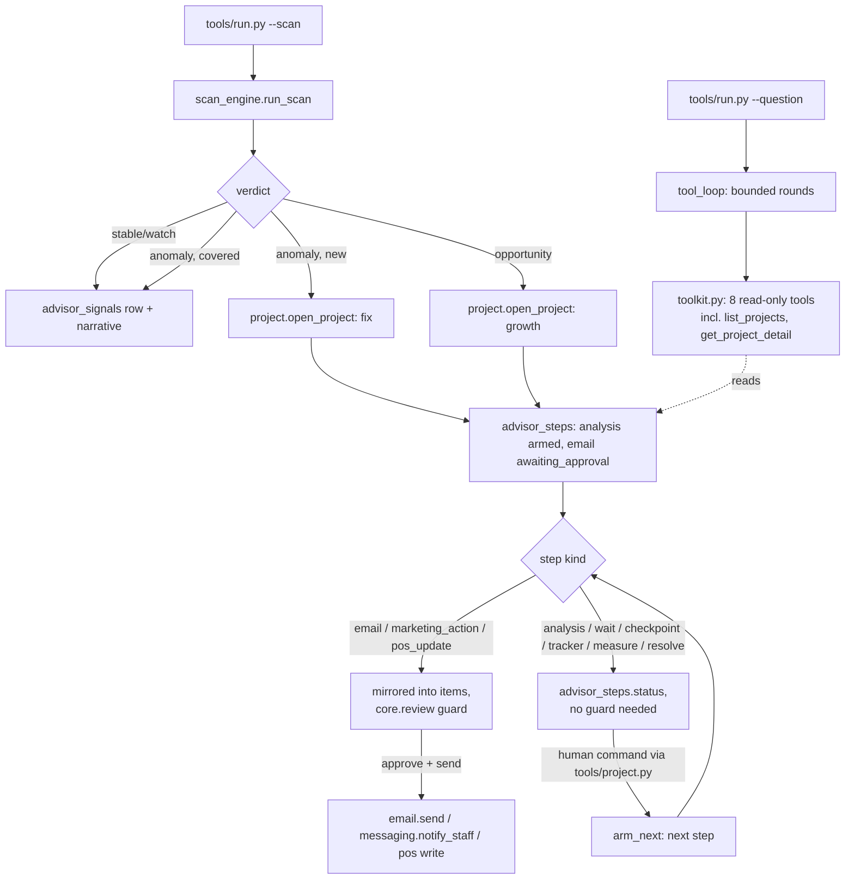

# How Strategic Advisor AI works

## Two loops, one project store

The Strategist has no inbox to poll. It has two triggers, both covered by
`tools/run.py`:

- **`--scan`** — the daily pulse (`tools/scan_engine.py` + `tools/scan.py`).
  Deterministic. Reads financials, reviews and competitor snapshots, and
  decides one of four verdicts: `stable`, `anomaly`, `opportunity`, `watch`.
  When it finds something new, it opens a **strategic project**.
- **`--question "..."`** — an ad-hoc question (`tools/ask_engine.py` +
  `tools/tool_loop.py` + `tools/toolkit.py`), the same resumable
  tool-calling pattern Portfolio Analyst AI uses: a stable question id
  (`ask-<day>-<hash>`), a bounded round loop, and `--resume <id>` to
  continue a pending one.

Both read the same three domain tables (`tools/project.py` owns writing to
them): `advisor_projects`, `advisor_steps`, `advisor_signals`. A project is
a strategic initiative with an ordered list of steps; `tools/project.py`
advances one step at a time, and every step that would touch something
outside the agent's own database — an email, a price change — goes through
`core.review`'s guard exactly like every other agent in this family.



## The daily scan (`tools/scan_engine.py`)

Eight deterministic steps, ported from the demo's `advisor-engine.ts`
(`specs/strategic-advisor-ai.md` section 3A):

1. Pull the full business picture (counts only).
2. RevPAR, last 7 days vs prior 7 — warn at `<= revpar_warn_pct` (default -8%).
3. Occupancy vs the same month last year (rule `yoy-baseline`) — warn at
   `<= occupancy_warn_pts` (default -5 points).
4. Department revenue pace vs last month, for Rooms / F&B / Spa — warn at
   `<= dept_pace_warn_pct` (default -5%).
5. Anomaly suppression — a project in `mode: fix` whose `metric_key` matches
   the department, active or resolved within `suppression_days` (default
   14), covers that metric so the scan does not re-report it.
6. Review sentiment, last 7 days — warn when negative count
   `>= review_negative_warn` (default 2).
7. Rule out external causes (rule `rule-out-external`) — see "Design
   decisions" below; this is honestly labelled, not a real integration.
8. Competitor watch (rule `competitor-watch`) — pairs each item's earliest
   and latest scrape; an opportunity fires when the strongest matching item
   move is `>= competitor_opportunity_pct` (default 8%).

Verdict: any unsuppressed anomaly wins (worst delta first); otherwise a
competitor opportunity; otherwise `stable` (or `watch` if the competitor
rule is off). `tools/scan.py` persists an `advisor_signals` row, logs an
event, and asks the LLM (task `narrate`) for a 3-4 sentence morning note.
**The verdict never depends on the LLM** — `narrate` only writes prose
around a verdict the deterministic engine already reached, and a failed or
pending narrative still lets the scan finish (the signal is saved with
`narrative: null`, never blocked on the model).

## Opening a project

When the scan reaches `anomaly` (new) or `opportunity`, `tools/scan.py`
calls `tools/project.py`'s `open_project()`. The **step template** for each
scenario is a deterministic list of `(kind, title)` pairs — never chosen by
the model:

- **fix** (a department dipped): `analysis -> email -> wait -> checkpoint ->
  marketing_action -> tracker -> resolve`.
- **growth** (a competitor pricing opportunity): `analysis -> email -> wait
  -> pos_update -> measure -> resolve`.

The LLM (task `draft_project`) only fills in the prose for the `analysis`
conclusion, the `email` subject/body, and the `marketing_action` brief —
given the scenario's numbers as context. It cannot change which steps exist
or their order.

## Step kinds and statuses

`advisor_steps.status`: `pending | armed | awaiting_approval | awaiting_reply
| tracking | scheduled | done`. `arm_next()` (`tools/projects_engine.py`)
decides the entry status for the step after the one that just completed:

| kind | entry status | needs the review guard? |
|---|---|---|
| `analysis` | `armed` (renders immediately) | no |
| `email` | `awaiting_approval` | **yes** — `email.send` |
| `wait` | `armed` (a due date) | no |
| `checkpoint` | `armed` (a human decision) | no |
| `marketing_action` | `awaiting_approval` | **yes** — `send_message` (staff notify) |
| `tracker` | `tracking` (live count) | no |
| `pos_update` | `awaiting_approval`, then `scheduled` after approval | **yes**, twice — `pos_price_change` |
| `measure` | `armed` | no |
| `resolve` | `armed` | no |

Only the three kinds that reach outside the agent's own database — `email`,
`marketing_action`, `pos_update` — are mirrored into the shared `items`
table (`kind="advisor_step"`) and go through `core.review`'s
`approved/edited/rejected -> sending -> sent` machine, so `tools/review.py`
(the same queue tool every repo in this family ships) is the only writer of
those decisions. Everything else is an internal step a human advances
directly with `tools/project.py <verb> <step_id>` — still requiring an
explicit human command (never auto-fires), just not the guarded-write FSM,
because nothing leaves the building.

### The two-phase price change (`pos_update`)

`core/adapters/base.py`'s `POS` stub has no write method (point-of-sale
integrations are too varied for one interface) — see "Design decisions".
`tools/project.py apply-pos` calls `core.review.assert_write_allowed(settings,
"pos_price_change", item)` directly (the same function every
`@guarded_write` decorator calls) before attempting anything, so the guard
is identical to a built adapter's. **Approve** only schedules — *"Nothing
changes in the till until then."* A second, dated **apply** actually writes
(once a real POS adapter is implemented; until then it reports the stub
recipe from `docs/integrations.md`).

### Tracker

Counted live from the reviews table on every render, never a stored number:
`pos = reviews with rating >= min_rating since <date>`, `neg = rating <= 3`.
`tools/project.py fast-forward-tracker` is a demo-only convenience,
labelled as such, that inserts the remaining seeded positive reviews.

### Measure (folds the demo's `collect_data` + `analysis_run`)

```
deltaPct   = (targetUnits - baselineUnits) / baselineUnits * 100
attach     = sum(units) / sum(covers)
uplift     = round(targetUnits * (price_to - price_from) * 30.4)
keep_price = deltaPct > -(rollback_threshold_pct)
```
Reads `fixtures/hotel/pos_sales_daily.json` (or a hotel's own
`data/imports/pos_sales_daily.csv`) for the baseline and target month.
**It never fabricates rows** — see "Design decisions".

### Resolve

`tools/project.py resolve <id> --measured <amount> --impact "..."` sets
`advisor_projects.status = 'resolved'`, `resolved_on`, `measured_impact`.
The KPI **Measured impact (see `tools/report.py`)** sums `measured_impact`
across `resolved` projects only. `tools/project.py abandon <id> --reason
"..."` sets `status = 'abandoned'` — see "Design decisions".

## The ask loop

Identical shape to Portfolio Analyst AI's: `question_external_id()` hashes
the normalized question text plus the day into `ask-<day>-<hash>`, so
re-running the same command resumes instead of restarting. Every round that
resolves is cached on `item.payload["_rounds"]`
(`tools/tool_loop.py`), which survives `upsert_item`'s payload refresh
because it is underscore-prefixed. Eight read-only tools
(`tools/toolkit.py`): `get_daily_pulse`, `list_projects`,
`get_project_detail`, `get_financial_metrics`, `get_review_sentiment`,
`get_competitor_watch`, `search_knowledge_base`, `generate_report`. None of
them writes anything — the Strategist's "never acts without sign-off"
promise is enforced by what tools exist, the same way Portfolio Analyst
AI's read-only guarantee is. A data source with no CSV dropped in
`data/imports/` returns `{"connected": false, "message": "..."}` instead of
the bundled Hotel Aurora fixture, and the prompt tells the model to repeat
that message rather than guess.

**Language.** `tools/tool_loop.py: answer_language_guidance()` runs
`core.i18n.detect_language()` on the question once per call (no model call,
deterministic) and puts the result on the Item block's `answer_language`
field before every round: the question's own language when it is one of
`hotel.languages`, otherwise the hotel's default language plus a one-line
note that the question's language is not supported yet. `prompts/ask.md`'s
System section tells the model to follow that field exactly, so a
Portuguese question gets answered in Portuguese when `pt` is one of the
hotel's languages, and a question in an unsupported language still gets a
readable answer instead of a guess at tone (fixes SIMULATION.md Finding 4).

## Rules

`config/agent.yaml: rules:` holds the four on/off toggles from the spec
(`yoy-baseline`, `rule-out-external`, `verify-cross-sources`,
`competitor-watch`). A missing rule id defaults to **enabled**, matching the
source engine's `on(id)`.

## What runs when

| Workflow | Command | Cadence |
|---|---|---|
| Daily scan | `tools/run.py --once --scan` | morning, daily |
| Ask a question | `tools/run.py --once --question "..."` | on demand |

`config/agent.yaml: schedule:` is the source of truth; `make schedule
ARGS="--all"` prints the snippet for this machine.

## Design decisions (spec was silent, or the demo's own pattern was a
known anti-pattern to avoid)

1. **Rules are a config block, not a database table.** The demo's
   `advisor_rules` table only ever holds on/off switches a human edits
   through a UI this template does not have; `config/agent.yaml` is the
   hotel-editable surface everywhere else in this family, so the rules live
   there too.
2. **`advisor_activity` is `core.store.events`, not a fifth table.** Every
   step transition already calls `store.record_event()`; a second audit log
   would just be a duplicate of the one this family already ships and
   `tools/review.py show` already prints.
3. **Thresholds are config knobs** (`config/agent.yaml: thresholds:`), not
   magic numbers — fixes the spec's open question 6.
4. **Anomaly suppression works for every department**, keyed by
   `advisor_projects.metric_key` (`revenue_rooms` / `revenue_fnb` /
   `revenue_spa`), not a substring match on the project title — fixes open
   questions 3 and 4.
5. **`rule-out-external` is honestly labelled a placeholder.**
   `docs/integrations.md` says plainly that no news/events/weather feed is
   wired up; the checklist line says "not checked — no news/events/weather
   feed configured" when the rule is on, instead of claiming a check that
   never happens. This is a deliberate correction of the spec's open
   question 2, not a port of the demo's wording.
6. **`measure` never fabricates POS data.** The demo inserts 31 synthetic
   nightly closes and then "measures" its own fabrication (open question
   10) — a pattern explicitly flagged as unfit for production. This
   template reads real (or fixture) rows from
   `data/imports/pos_sales_daily.csv` / `fixtures/hotel/pos_sales_daily.json`
   and says so if the file is missing, the same `connected: false` pattern
   as every other data source.
7. **Projects can be `abandoned`.** The demo has no way to close a project
   as "did not work" (open question 14); `tools/project.py abandon` adds
   the missing terminal state so "measured impact" is not a survivorship
   figure.
8. **One property description.** The spec flags a conflict between the
   scan prompt ("500 rooms") and another agent's prompt ("84 rooms") for
   the same fictional hotel (open question 15). This repo's
   `fixtures/hotel/property.md` picks one (see the file) and uses it
   everywhere.
9. **`marketing_action` reuses the `email` gate's mechanics** but sends
   through `core.adapters.get_messaging(settings).notify_staff(...)`
   instead of email — a marketing brief (front-desk script, flyer copy)
   is staff-facing, not guest-facing, and the messaging adapter already
   has a built-in staff-notify write.
10. **Restaurant lens.** `venues: [hotel, restaurant]`. The scan's metric
    set becomes covers / spend-per-head / sales-per-service / table turns /
    no-show rate, and department pace becomes food / drink / wine / events
    — see README "Who it's for". The competitor watch already speaks
    restaurant (it compares menu items), so it needs no translation.
11. **A project's steps live in one JSON column** (`advisor_projects.steps_json`),
    not a second table — the whole ordered list is always read and written
    together (open one project, see every step), and nothing needs a
    cross-project step query, so a normalized `advisor_steps` table would
    only add join overhead for no real benefit.
12. **A shadow-blocked send still counts as done, for sequencing** (fixes
    SIMULATION.md Finding 2). Before this, `send_step`'s `WriteBlocked`
    branch left the step at `awaiting_approval` forever and never called
    `arm_next()`, so a real project in `mode: shadow` could never get past
    its first `email`/`marketing_action` step — the fuller step machine
    (`checkpoint`, `tracker`, `pos_update`, `measure`, `resolve`) was only
    ever visible on `make demo`'s seeded, isolated `data/demo/demo.db`.
    Now: the approval is still recorded, the write is still blocked with
    "approval kept", but the step is marked `done` with its own payload
    saying `"sent": "no (shadow)"` — never confusable with a real send —
    and `arm_next()` runs exactly as it would after a real send. A hotel can
    walk an entire project, start to finish, without leaving shadow mode.
    Calling `send-step` again on the same, already-blocked step is a no-op
    (it does not re-arm a step that has since moved on its own) — the guard
    is `already_done = step["status"] == "done"` before overwriting it.
13. **CSV-fallback sources are disclosed per-source, and a project built
    from any of them is tagged `_sample`** (fixes SIMULATION.md Finding 1).
    `tools/scan.py` used to print a "not connected" note only for
    `financial_daily.csv`, still silently scanning the bundled Hotel Aurora
    fixture for `reviews.csv`/`competitor_snapshots.csv`/`pos_items.csv`
    with no disclosure at all — on a real, partially-connected property this
    could open a named project (e.g. "Reprice Aurora Burger") proposing
    action on a menu item that does not exist there. Now every one of the
    four CSV sources prints its own "not connected" note. Financial and
    reviews still fall back to the fixture when unconnected (unchanged,
    matching every other agent in this family that reads CSV exports); the
    competitor watch — the specific mechanism behind the "Aurora Burger"
    example, since it is the one check that names a menu item as an
    opportunity — is **skipped** instead when either
    `competitor_snapshots.csv` or `pos_items.csv` is unconnected: it runs on
    an empty comparison and so can never surface a fixture item as a real
    one. Whenever ANY of the four sources was unconnected at scan time, the
    resulting project (and every gated step mirrored from it) is tagged
    `is_sample` / `_sample` — the same payload key
    `core.store.Item.is_sample` already reads — and `tools/project.py`
    show/list and `tools/review.py` show/list print `[SAMPLE]` for it.
    `make doctor`'s financial/reviews/competitor/POS checks now read the
    `*_connected()` booleans directly instead of a fixture-guaranteed row
    count, so they WARN, not PASS, while unconnected.

## Sub-agents

None. Top-level, no children (`specs/briefs/strategic-advisor-ai.md`).
